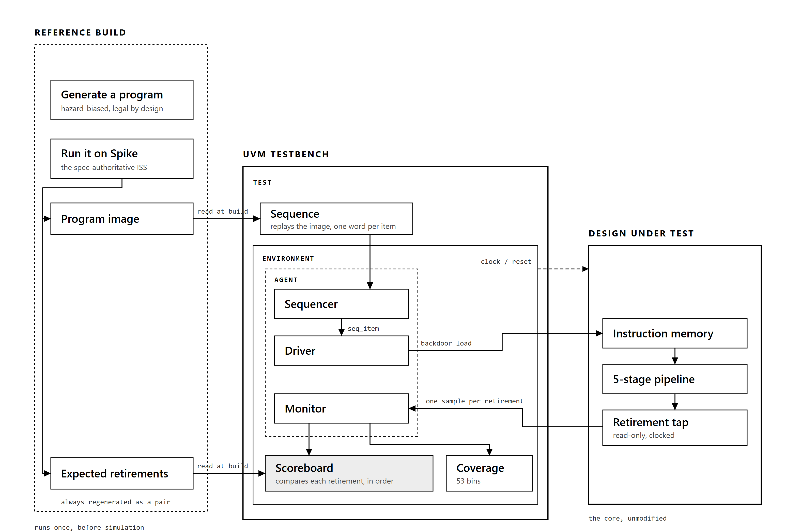
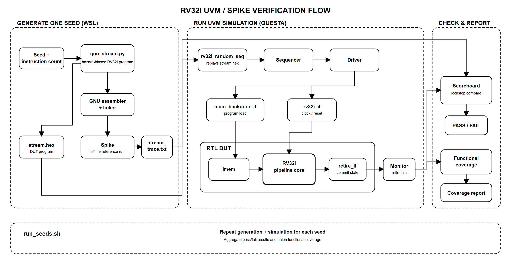

# RV32I pipelined core

A 5-stage pipelined RV32I CPU in SystemVerilog, with M-mode CSRs, synchronous
traps, a machine timer interrupt, external debug halt/resume, and two
memory-mapped peripherals. Verified against [Spike](https://github.com/riscv-software-src/riscv-isa-sim),
RISC-V International's reference simulator.

```bash
cd rtl && ./run_sim.sh
```

Runs three self-checking testbenches under both Icarus Verilog and Verilator,
whichever are installed, and reports PASS/FAIL per testbench. All three pass on
both.

What is *not* claimed is in [docs/ROADMAP.md](docs/ROADMAP.md): no
`riscv-arch-test` run, no privileged instructions in the random stimulus, no
physical design. [docs/VMATRIX.md](docs/VMATRIX.md) maps every design feature
to its stimulus, checker, assertions and coverage, including the gaps.

## Layout

```
rtl/           the core, its directed testbenches, and the test-program
               generator (testgen/).

verif/spike/   the reference model. Spike generates the golden register and
               memory values every directed testbench checks against, plus the
               UVM environment's instruction stream and expected retirement
               trace.

verif/uvm/     a UVM environment: hazard-biased instruction generation,
               backdoor program loading, a scoreboard that lockstep-checks
               every retirement against Spike, and functional coverage.
               Runs under Questa Starter Edition -- see RUNNING.md.

verif/sva/     SystemVerilog assertions for the forwarding, interlock and
               flush logic, bound into riscv_pipe so the synthesizable RTL
               is never touched by verification code.

verif/wave/    waveform extraction helper.

docs/          DESIGN_GUIDE.md, how the core works and why.
               JOURNAL.md, how it got built and what broke on the way.
               BUGS.md, every defect found, its root cause, and the check
               that now guards it.
```

## Status

The core passes `hazard`, `debug` and `csr` against golden values generated by
Spike, under both Icarus Verilog and Verilator. `run_sim.sh` skips whichever
simulators are absent.

Both simulators are run because they disagree about uninitialised memory, and
one of the RTL bugs found in this project is invisible to Verilator for exactly
that reason.



The reference build on the left runs once, before simulation. The DUT on the
right is the unmodified core: the retirement tap is read-only, while
verification-only interfaces attached with `bind` load the program and clear
data memory while reset is asserted. No reset network or verification port is
added to the synthesizable memories.

The UVM environment runs under Questa Starter Edition:

```bash
cd verif/uvm && ./run_uvm.sh        # one seed
cd verif/uvm && ./run_seeds.sh 10   # multi-seed regression + cross-seed coverage
```

The complete flow for one seed, together with the outer multi-seed regression,
is shown below:



Ten seeds pass with zero mismatches, zero `UVM_ERROR`, and zero simulator
errors, checking 72-83 instructions each against Spike, at 68-80% of the
59-bin hazard coverage model per seed. Across the ten, all 59 bins are hit.
That number measures hazard-stimulus quality against a model
built for the hazard machinery; it is not a claim of ISA-level coverage, which
has no model yet (`docs/ROADMAP.md`).

A seed passes only if the UVM verdict is PASS *and* the simulator's own error
count is zero -- bound-assertion failures land in the second count, not the
first, and the regression's failure path is itself verified by a seeded
always-false assertion (`docs/BUGS.md`, V12).

The `x_op_rs1.load_d{1,2,3}` bins are reached when an early body load consumes
the `x1` base pointer written immediately before the body. The generator still
never rewrites `x1` later; recurring dependent-base loads would need a bounded
scratch pointer, which `docs/ROADMAP.md` tracks.

The regression prints each hole by name rather than leaving it inside a
percentage, so a gap has to be argued with rather than averaged away.


## What is checked

Every retirement is compared against Spike, in order, on four axes: the PC, the
instruction word, the register writeback, and the store address and data. A
divergence in PC or instruction is treated as terminal, because once the two
sides are out of step every later comparison is meaningless.

Coverage is collected as a plain-SystemVerilog bin tally, so it reports on any
simulator, with parallel `covergroup` blocks (written, never yet executed) behind `` `ifdef RV32I_COVERAGE ``
for licensed tools. Bound SystemVerilog assertions check the forwarding paths,
the load-use interlock and flush priority directly, inside the design, without
the synthesizable RTL ever importing verification code.

This is an RTL and verification project: it stops at the RTL boundary, with no
SDC, floorplan or STA. `docs/ROADMAP.md` tracks what comes next.

## Where the trust boundary sits

Golden values come from Spike rather than from a model written alongside the
RTL, because a reference written by the same person as the design, from the same
reading of the specification, cannot catch a misreading of the specification:
both sides express the same misunderstanding and the test passes anyway. Spike
is maintained by RISC-V International and is what the official compliance suite
uses to generate its reference signatures, so a disagreement between Spike and
this core is evidence about the core.

Two things sit outside that boundary, and are marked as such. `clint.sv` and
`uart_tx.sv` are project-specific peripherals with no standard to conform to, so
a small Spike MMIO plugin models them -- about 60 lines with no branching
semantics, the smallest surface that keeps timer and UART behaviour covered.

`docs/DESIGN_GUIDE.md` section 8 has the full table of legitimate model
differences and how each is handled.

## Regenerating golden values

The `.svh` golden-value files in `rtl/` are committed, so running the regression
needs no Spike. Regenerating them does:

```bash
cd verif/spike
SPIKE=/path/to/spike ./regen.sh
```

Do this after changing any test program in `rtl/testgen/`. See
`verif/spike/README.md` for building Spike, including the two platform constants
that have to move because this core resets to PC 0 and Spike reserves the bottom
of the address space for itself.

`run_seeds.sh` also needs Spike. Spike has no Windows build, so the script
invokes WSL to generate each seed's program and golden trace, then simulates
natively on Windows, compiling once and re-elaborating per seed. `run_sim.sh` and
`run_uvm.sh` need no Spike -- their stimulus is committed.
