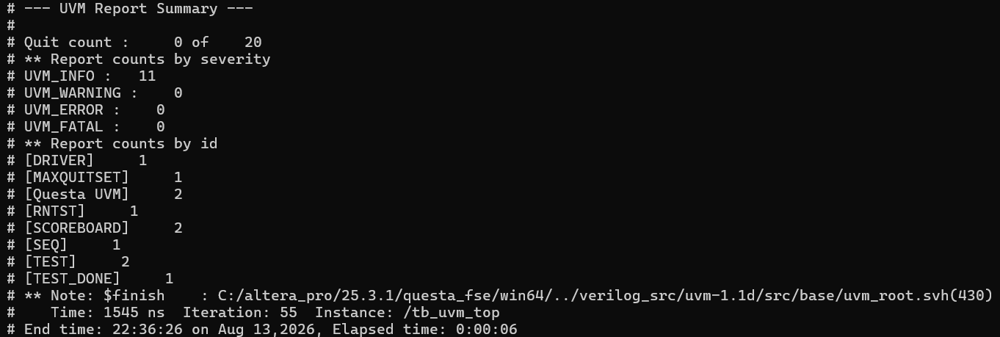

# RV32I pipelined core

A 5-stage pipelined RV32I CPU in SystemVerilog, with M-mode CSRs, synchronous
traps, a machine timer interrupt, external debug halt/resume, and two
memory-mapped peripherals. Verified against [Spike](https://github.com/riscv-software-src/riscv-isa-sim),
RISC-V International's reference simulator.

```bash
cd rtl && ./run_sim.sh
```

Runs three self-checking testbenches under both Icarus Verilog and Verilator,
whichever are installed, and reports PASS/FAIL per testbench. All three pass on
both.

## Layout

```
rtl/           the core, its directed testbenches, and the test-program
               generator (testgen/). This is the project.

verif/spike/   the reference model. Spike generates the golden register and
               memory values every directed testbench checks against, plus the
               UVM environment's instruction stream and expected retirement
               trace.

verif/uvm/     a UVM environment: hazard-biased instruction generation,
               backdoor program loading, a scoreboard that lockstep-checks
               every retirement against Spike, and functional coverage.
               Runs under Questa Starter Edition -- see RUNNING.md.

verif/sva/     SystemVerilog assertions for the forwarding, interlock and
               flush logic, bound into riscv_pipe so the synthesizable RTL
               is never touched by verification code.

verif/wave/    waveform extraction helper.

docs/          DESIGN_GUIDE.md, how the core works and why.
               JOURNAL.md, how it got built and what broke on the way.
```

## Status

The core passes `hazard`, `debug` and `csr`, against golden values generated by
Spike. Verilator is not installed on the current machine, so that result is
Icarus-only today; `run_sim.sh` skips absent simulators automatically.

Running both simulators is deliberate rather than belt-and-braces. They disagree
about uninitialised memory, and one of the two real RTL bugs found in this
project is invisible to Verilator for exactly that reason. Green on one is not
treated as green.

The UVM environment now runs, under the Questa Starter Edition bundled with
Altera Pro:

```bash
cd verif/uvm && ./run_uvm.sh        # one seed
cd verif/uvm && ./run_seeds.sh 10   # multi-seed regression + cross-seed coverage
```

Ten seeds pass with zero mismatches and zero `UVM_ERROR`, checking 133-161
instructions each against Spike, at 61-71% of 53 functional-coverage bins.



Running it found the sixth real bug in this project, and the way that one
surfaced is the most useful thing in `docs/JOURNAL.md`: the MEM-stage
forwarding mux forwarded `ALUResultM` unconditionally, which is the wrong
value for a CSR read (`CsrRdataM`) and for JAL/JALR (`PCPlus4M`). It had been
masked by an accident of bit numbering -- `IsLoadE` was `ResultSrc[0]`, true
for both `RESULT_MEM` and `RESULT_CSR`, so CSR reads were stalled rather than
forwarded. Removing that aliasing exposed it, and `tb_pipe_csr` hung forever:
the trap handler's `mepc += 4` wrote back a stale value, so `mret` returned to
the `ecall` that trapped and re-trapped indefinitely. The JAL/JALR half was
never covered by any test and was wrong in every version of the file. See
`FwdResultM` in `rtl/datapath.sv`.

Not done, and worth being explicit about:

- **`riscv-arch-test` has not been run.** It is the highest-value next step and
  is no longer blocked.
- **Functional coverage is measured but not closed.** Seven bins are
  unreachable by the current generator, including every `rs2` dependency
  distance -- the hazard bias forces `rs1` only, so the `ForwardBE` path is
  barely stimulated.
- **The SystemVerilog covergroups have not been run.** Questa Starter Edition's
  licence withholds `covergroup`, so the coverage model is implemented twice:
  a plain-SystemVerilog bin tally that runs and reports, and the equivalent
  covergroups behind `` `ifdef RV32I_COVERAGE `` for a licensed simulator.
- **No synthesis numbers.** No SDC, so no fmax, area, or critical path.
- **Not tapeout-ready**, and not close: `imem` is an inferred array with an
  `initial $readmemh` rather than an SRAM macro with a boot path, and there is
  no DFT, no power intent, and no STA.

## Where the trust boundary sits

Golden values come from Spike rather than from a model written alongside the
RTL, because a reference written by the same person as the design, from the same
reading of the specification, cannot catch a misreading of the specification.
Both sides express the same misunderstanding and the test passes carrying no
information.

Two things cannot come from Spike: `clint.sv` and `uart_tx.sv` are
project-specific peripherals with no standard to conform to, so a small Spike
MMIO plugin models them. That restates a design decision rather than making an
independent claim about correctness.

`docs/DESIGN_GUIDE.md` section 8 has the full table of legitimate model
differences and how each is handled. That table is the co-simulation
environment; the diff is trivial by comparison.

## Regenerating golden values

The `.svh` golden-value files in `rtl/` are committed, so running the regression
needs no Spike. Regenerating them does:

```bash
cd verif/spike
SPIKE=/path/to/spike ./regen.sh
```

Do this after changing any test program in `rtl/testgen/`. See
`verif/spike/README.md` for building Spike, including the two platform constants
that have to move because this core resets to PC 0 and Spike reserves the bottom
of the address space for itself.

`run_seeds.sh` additionally needs Spike, which has no Windows build and lives in
WSL: it generates each seed's program and golden trace there, then simulates
natively, compiling once and re-elaborating per seed. `run_sim.sh` and
`run_uvm.sh` need no Spike -- their stimulus is committed.
